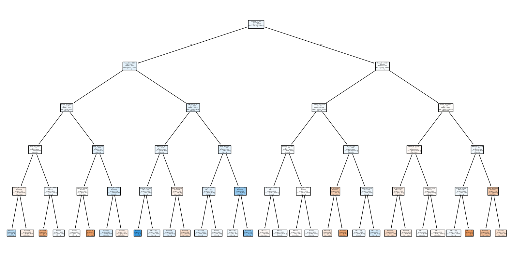

# Modelo de Árvore de Decisão para Previsão de Movimentos do S&P 500

## 1. Introdução
Este projeto tem como objetivo desenvolver um modelo de **árvore de decisão** para prever se o preço de fechamento diário das ações do índice **S&P 500** apresentará valorização ou desvalorização no próximo pregão.  
Foi utilizado o dataset público do [Kaggle](https://www.kaggle.com/datasets/camnugent/sandp500), passando por etapas de **limpeza de dados**, **engenharia de features** e **modelagem preditiva** com validação temporal.

---

## 2. Tecnologias Utilizadas
- **Python 3.11**: linguagem principal para análise e modelagem  
- **pandas**: tratamento e pré-processamento de dados  
- **numpy**: operações matemáticas e vetorização  
- **scikit-learn**: implementação do `DecisionTreeClassifier`  
- **matplotlib**: geração de visualizações gráficas  
- **kagglehub**: aquisição programática do dataset

---

## 3. Metodologia
1. **Aquisição e Limpeza de Dados**: conversão de datas, remoção de valores ausentes e padronização de colunas.  
2. **Engenharia de Features**: criação de indicadores como retornos diários, médias móveis, volatilidade, RSI e variações intradiárias.  
3. **Definição da Variável-Alvo**: `target_up_next` (1 para valorização, 0 para desvalorização).  
4. **Divisão Temporal dos Dados**: 80% para treino e 20% para teste, preservando a ordem cronológica para evitar **data leakage**.  
5. **Modelagem**: uso de `DecisionTreeClassifier` com `max_depth=6` e `random_state=42`.

---

## 4. Resultados
- **Acurácia**: aproximadamente 55–60%, variando conforme a ação e a janela temporal analisada.  
- **Importância das Features**: retornos recentes, volatilidade e RSI se destacaram como indicadores relevantes.  
- **Visualização da Árvore de Decisão**:  

