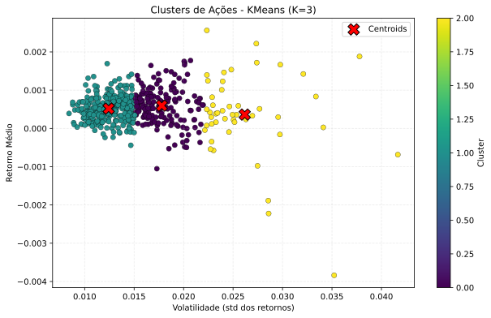

---

# Modelo K-Means para Agrupamento de Ações

## 1. Introdução

Este projeto implementa um modelo de **K-Means Clustering** para agrupar ações com base em seus retornos médios e volatilidade (desvio-padrão dos retornos) utilizando o dataset `all_stocks_5yr.csv`.
O objetivo é identificar padrões de risco e retorno entre diferentes empresas da bolsa, permitindo observar grupos de ações “mais estáveis”, “mais arriscadas”, etc.

---

## 2. Tecnologias Utilizadas

* **Python 3.11**
* **pandas, numpy** - manipulação de dados
* **scikit-learn** - KMeans
* **matplotlib** - visualização de clusters

---

## 3. Metodologia e Etapas

### Etapa 1 — Exploração dos Dados

* **Objetivo**: Carregar e entender a estrutura do dataset `all_stocks_5yr.csv`
* **Entregáveis**: estatísticas básicas, tickers disponíveis, datas, preços
* **Features relevantes**: preço de fechamento (`close`)

### Etapa 2 — Pré-processamento

* **Objetivo**: Construir métricas de retorno e risco por ação
* **Ações**:

  * Calcular **retorno diário** por ticker: `pct_change` no preço de fechamento
  * Calcular **retorno médio** por ticker
  * Calcular **volatilidade** (desvio-padrão dos retornos) por ticker
  * Remover valores ausentes

### Etapa 3 — Clusterização com K-Means

* **Objetivo**: Identificar grupos de ações semelhantes
* **Configuração**:

  * Número de clusters `K = 3` (pode ser ajustado)
  * Inicialização com `random_state=42`
  * `n_init=10` para maior robustez
* **Features usadas no KMeans**:

  * `mean_return`
  * `volatility`

### Etapa 4 — Visualização

* **Objetivo**: Plotar os clusters em gráfico de dispersão
* **Eixos**:

  * X: Volatilidade
  * Y: Retorno médio
* **Visualização**: Ações coloridas por cluster

---

## 4. Resultados

O K-Means gera três clusters distintos:

* **Cluster 0** → Ações mais estáveis, baixo risco e retornos modestos
* **Cluster 1** → Ações mais voláteis, maior risco, possibilidade de maiores retornos
* **Cluster 2** → Ações intermediárias em termos de risco e retorno

Exemplo (primeiros resultados):

| Name | mean\_return | volatility | cluster |
| ---- | ------------ | ---------- | ------- |
| A    | 0.000453     | 0.015482   | 2       |
| AAL  | 0.001245     | 0.022456   | 1       |
| AAP  | 0.000443     | 0.018958   | 2       |
| AAPL | 0.000786     | 0.014593   | 0       |
| ABBV | 0.001050     | 0.016856   | 2       |

---

## 5. Visualização dos Clusters

### Gráfico



---

## 6. Código Implementado

### K-means.py

```python

import os
import pandas as pd
import numpy as np
from sklearn.cluster import KMeans
import matplotlib.pyplot as plt


script_dir = os.path.dirname(os.path.abspath(__file__))   # pasta onde está este script
csv_path = os.path.join(script_dir, "..", "KNN", "all_stocks_5yr.csv")  # ../KNN/all_stocks_5yr.csv
output_svg = os.path.join(script_dir, "kmeans_clusters.svg")
output_csv = os.path.join(script_dir, "clusters_result.csv")

print(f"Carregando dados de: {csv_path}")
df = pd.read_csv(csv_path)


df['return'] = df.groupby('Name')['close'].pct_change()


stats = df.groupby('Name').agg({'return': ['mean', 'std']}).reset_index()
stats.columns = ['Name', 'mean_return', 'volatility']

stats = stats.dropna().reset_index(drop=True)
print(f"Número de tickers depois do dropna: {len(stats)}")

X = stats[['mean_return', 'volatility']].values


K = 3
kmeans = KMeans(n_clusters=K, random_state=42, n_init=10)
labels = kmeans.fit_predict(X)
stats['cluster'] = labels


plt.figure(figsize=(10, 6))
scatter = plt.scatter(stats['volatility'], stats['mean_return'], c=stats['cluster'], cmap='viridis', s=40, edgecolor='k', linewidth=0.3)

plt.xlabel("Volatilidade (std dos retornos)")
plt.ylabel("Retorno Médio")
plt.title(f"Clusters de Ações - KMeans (K={K})")
cbar = plt.colorbar(scatter)
cbar.set_label('Cluster')


centroids = kmeans.cluster_centers_
plt.scatter(centroids[:, 1], centroids[:, 0], marker='X', s=200, c='red', label='Centroids', edgecolor='k')

plt.legend(loc='best')
plt.grid(alpha=0.25, linestyle='--')


plt.savefig(output_svg, format='svg', bbox_inches='tight', dpi=300)
print(f"Gráfico salvo como: {output_svg}")


plt.show()


stats.to_csv(output_csv, index=False)
print(f"Resultados dos clusters salvos em: {output_csv}")

print("\nResumo por cluster (count, mean volatility, mean return):")
summary = stats.groupby('cluster').agg({
    'Name': 'count',
    'volatility': 'mean',
    'mean_return': 'mean'
}).rename(columns={'Name': 'count'}).reset_index()
print(summary.to_string(index=False))

```

---

## 7. Como Executar

1. **Preparar ambiente**:

```bash
pip install pandas numpy scikit-learn matplotlib --upgrade
```

2. **Rodar script**:

```bash
python K-means.py
```

3. **Requisitos**:

   * Arquivo `all_stocks_5yr.csv` localizado em `../KNN/`
   * Python 3.7+ instalado

---

## 8. Limitações e Melhorias Futuras

### Limitações

* Escolha de `K` influencia bastante os resultados
* Retorno médio e volatilidade não capturam toda a complexidade dos ativos
* Dataset histórico pode não refletir risco futuro

### Melhorias Futuras

* Selecionar `K` com **método do cotovelo (Elbow Method)** ou **Silhouette Score**
* Adicionar outras features (volume, indicadores técnicos, etc.)
* Comparar com outros métodos de clustering (DBSCAN, Agglomerative)
* Validar clusters com dados em períodos diferentes

---

## 9. Conclusão

O modelo K-Means mostrou-se eficaz para agrupar ações com base em métricas simples de risco e retorno.
Os clusters oferecem insights sobre perfis de ativos e podem ser usados como ponto de partida para estratégias de investimento ou estudos comparativos.

---

## 10. Referências

* Scikit-learn documentation: [KMeans](https://scikit-learn.org/stable/modules/generated/sklearn.cluster.KMeans.html)
* pandas documentation: [Data manipulation](https://pandas.pydata.org/docs/)
* matplotlib: [Visualization techniques](https://matplotlib.org/stable/gallery/index.html)

---

