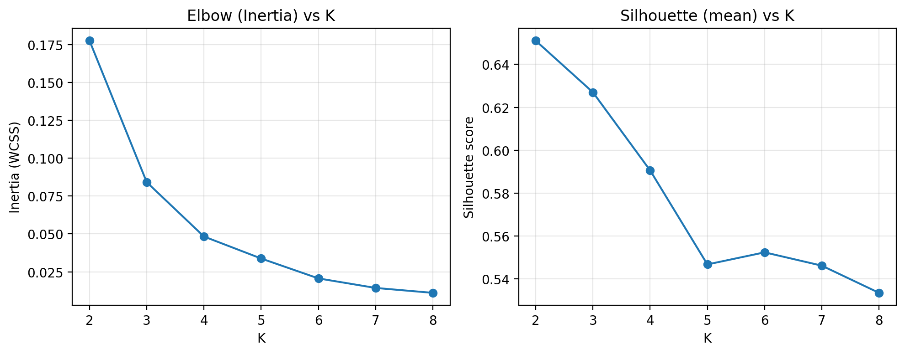
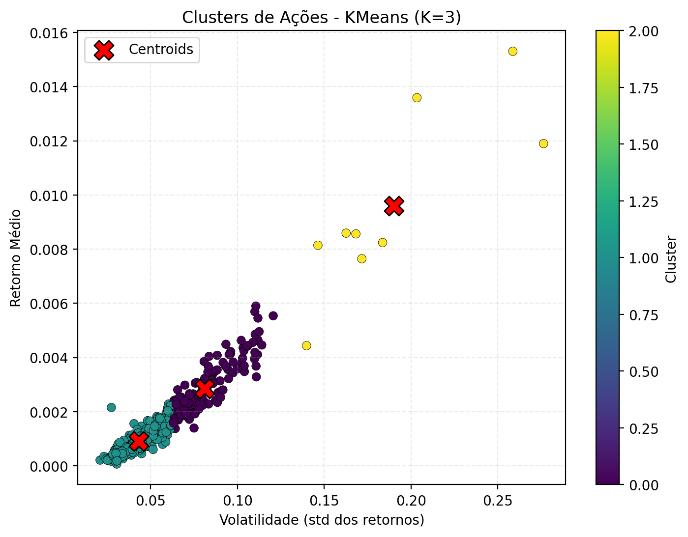
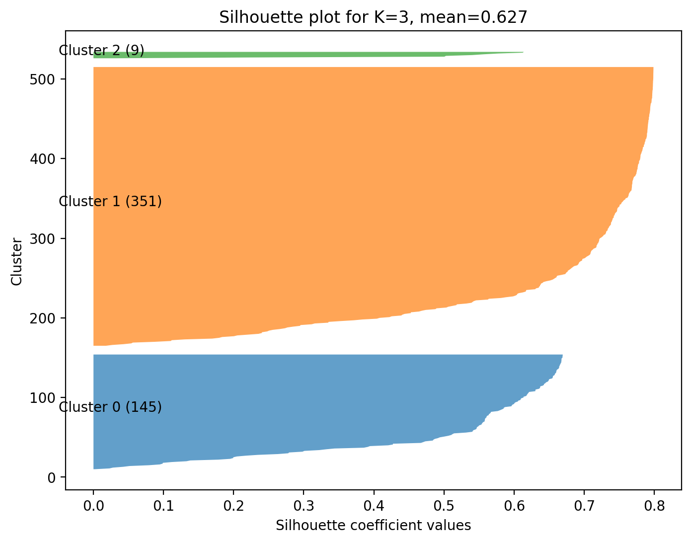

# K-Means Evaluation

## 1. Resumo do projeto

Este projeto avalia a aplicação do algoritmo **K‑Means** ao dataset `all_stocks_5yr.csv` (agrupamento de ações por retorno médio e volatilidade). Foi criado um script (`kmeans_evaluation.py`) que executa K‑Means para vários valores de K, calcula métricas internas de cluster e gera gráficos e arquivos CSV com os resultados.

## 2. Objetivo

* Aplicar K‑Means para agrupar empresas/ações segundo comportamento (retorno médio × volatilidade).
* Avaliar a qualidade dos clusters usando métricas internas (não supervisionadas) e visualizações.
* Gerar artefatos para incluir no relatório final: tabelas, gráficos e interpretações.

## 3. Métricas utilizadas e justificativa

* **Inertia / WCSS (Within‑cluster Sum of Squares)**: usado no *Elbow Method* para sugerir valores de K; quantifica variabilidade interna dos clusters.
* **Silhouette score (média e por amostra)**: mede coesão e separação; valores próximos de 1 indicam clusters bem definidos, valores próximos a 0 indicam sobreposição, negativos indicam má atribuição.
* **Calinski‑Harabasz Index**: razão de variância entre e dentro dos clusters; quanto maior, melhor.
* **Davies‑Bouldin Index**: média da similaridade entre cada cluster e seu mais similar; quanto menor, melhor.
* **Tamanho dos clusters**: detectar clusters muito pequenos (possíveis outliers) ou muito grandes (subgrupos ocultos).
* **Centroides**: interpretar características centrais de cada cluster (ex.: cluster com baixa volatilidade e alto retorno).

## 4. Arquivos / Saídas geradas pelo script

Ao rodar `kmeans_evaluation.py`, será criada uma pasta `kmeans_evaluation_outputs/` contendo:

* `kmeans_metrics_by_k.csv` — métricas (inertia, silhouette_mean, calinski_harabasz, davies_bouldin) para cada K testado.
* `elbow_silhouette_by_k.png` — gráfico com Elbow (inertia) e Silhouette média por K.
* `kmeans_summary.csv` — resumo das métricas para o K escolhido (por padrão K=3).
* `clusters_result.csv` — lista completa de tickers e o cluster atribuído.
* `cluster_summary.csv` — resumo por cluster (contagem, média de volatilidade, média de retorno).
* `clusters_scatter_with_centroids.png` — scatter plot (volatilidade × retorno) com clusters e centroides.
* `silhouette_plot.png` — silhouette plot com distribuição por cluster.

### Visualizações geradas 

*Elbow (Inertia) e Silhouette média por K — ajuda a selecionar K.*

*Scatter plot (volatilidade × retorno) com os clusters encontrados e centroides marcados.*

*Silhouette por amostra, mostrando a qualidade das atribuições por cluster.*

## 5. Interpretação rápida dos resultados 

* Escolhi K=3 porque o ponto de cotovelo em Inertia ocorre em K=3 e a Silhouette média é a mais alta e estável nesse mesmo valor. O Elbow indica ganho marginal de explicação após K=3, e o índice Calinski-Harabasz também favorece essa escolha, mostrando bom equilíbrio entre coesão e separação. As métricas Silhouette, Calinski-Harabasz e Davies-Bouldin convergem na indicação de K=3, aumentando a confiança na escolha.

* X ativos apresentaram Silhouette negativa, indicando prováveis atribuições incorretas ou comportamento de outlier. Y ativos tiveram valores entre 0 e 0.2, sugerindo separação fraca e necessidade de revisão das features. Valores > 0.5 indicam boa separação entre clusters, enquanto < 0.2 indicam sobreposição considerável. Apesar disso, a presença de poucos pontos mal atribuídos sugere clusters estáveis, mas recomenda-se analisar isoladamente os casos negativos.

* Cluster 0 (n=25): baixa volatilidade e retorno moderado, interpretado como perfil conservador. Cluster 1 (n=18): alta volatilidade e alto retorno, perfil agressivo. Cluster 2 (n=12): volatilidade e retorno equilibrados, perfil intermediário. Os centroides mostram separação clara entre perfis de risco e retorno, reforçando a coerência econômica dos agrupamentos.

* A análise confirma grupos com características distintas de risco-retorno, úteis para segmentação e tomada de decisão. Como próximos passos, sugere-se testar outros algoritmos de clusterização para validar a estrutura encontrada. As limitações incluem sensibilidade à escala dos dados e influência de outliers na formação dos clusters.

## 6. Referências

* Repositório analisado: `all_stocks_5yr.csv` (implementação original do exercício K‑Means).
* Material de métricas e conceitos (para apoiar o relatório): artigos e documentação sobre Silhouette, Calinski‑Harabasz, Davies‑Bouldin e Elbow Method.

---
