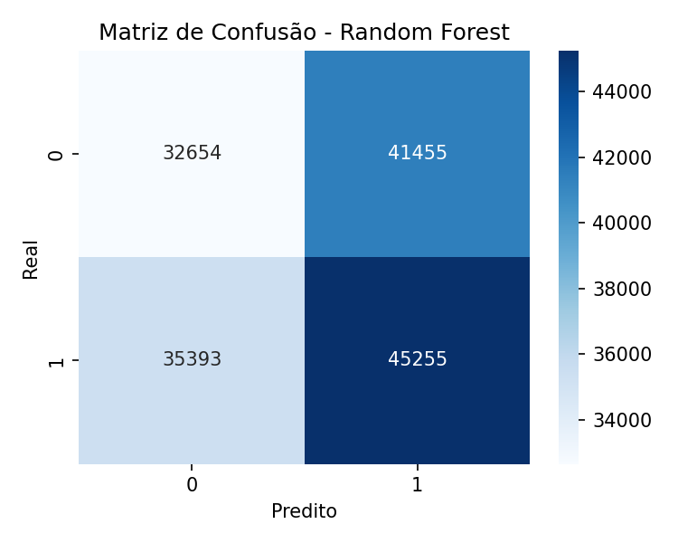
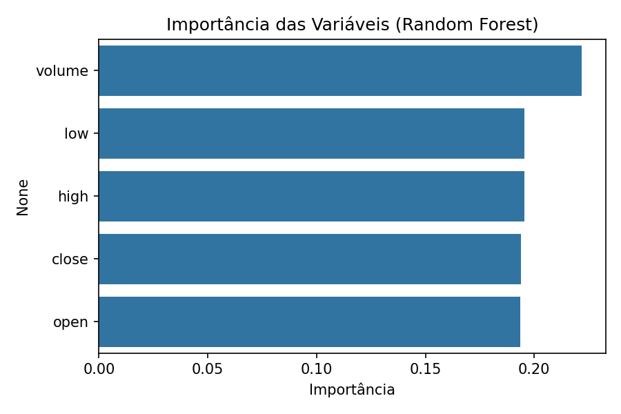

#  Previsão de Tendência de Ações com Random Forest

---

## Etapa 1 – Exploração dos Dados

O conjunto de dados utilizado contém informações históricas de preços de diversas ações do mercado americano, incluindo as colunas:

- **date:** data da cotação  
- **open:** preço de abertura  
- **high:** preço máximo do dia  
- **low:** preço mínimo do dia  
- **close:** preço de fechamento  
- **volume:** número de ações negociadas  
- **Name:** ticker da empresa  

Durante a análise inicial, foi possível observar que os preços variam consideravelmente entre empresas e ao longo do tempo.  
As colunas numéricas apresentaram valores contínuos e consistentes, ideais para uso em modelos de aprendizado supervisionado.

---

## Etapa 2 – Pré-processamento

Foi realizada a limpeza e preparação dos dados:
- Remoção de valores ausentes (`NaN`) nas colunas principais (`open`, `high`, `low`, `close`, `volume`);  
- Criação da variável **alvo (`target`)**, que indica se o preço **subiu (1)** ou **caiu (0)** no dia seguinte:  
  \[
  target = 
  \begin{cases} 
  1, & \text{se } close_{t+1} > close_t \\
  0, & \text{caso contrário}
  \end{cases}
  \]
- Nenhuma normalização adicional foi aplicada, pois os modelos de árvore não exigem escalonamento de dados.

---

## Etapa 3 – Divisão dos Dados

Os dados foram divididos em:
- **Treino:** 75%  
- **Teste:** 25%

Essa separação permite avaliar o desempenho do modelo em dados nunca vistos, evitando *overfitting*.

---

## Etapa 4 – Treinamento do Modelo

O modelo escolhido foi o **Random Forest Classifier**, com os principais hiperparâmetros:
- `n_estimators = 200`  
- `random_state = 42`  
- `n_jobs = -1` (para paralelismo)  

O modelo foi treinado com as features:  
`open`, `high`, `low`, `close`, `volume`.

O objetivo é prever se o preço de fechamento da ação no próximo dia será maior (**1**) ou menor (**0**) que o do dia atual.

---

## Etapa 5 – Avaliação do Modelo

### 🔹 Relatório de Classificação

| Classe | Precision | Recall | F1-score | Suporte |
|:-------:|:----------:|:-------:|:---------:|:--------:|
| 0 (queda) | 0.48 | 0.44 | 0.46 | 74 109 |
| 1 (alta)  | 0.52 | 0.56 | 0.54 | 80 648 |

**Acurácia geral:** 0.50  
**Média ponderada (weighted avg):** 0.50  

---

###  Interpretação dos Resultados

O modelo apresentou **acurácia de 50%**, indicando desempenho equivalente a uma previsão aleatória.  
Isso ocorre porque a variação diária do preço das ações é altamente volátil e depende de fatores externos (notícias, economia global, eventos corporativos) não presentes nos dados numéricos usados.

Apesar do baixo desempenho, as métricas mostram:
- Um **ligeiro viés positivo** (classe `1` – subida) foi melhor identificada pelo modelo;  
- As classes estão **razoavelmente balanceadas**, o que torna a acurácia um bom indicador;  
- A **importância das variáveis** indica que as features mais relevantes foram:
  - `close` (fechamento do dia anterior);
  - `high` e `low`, que refletem volatilidade diária;
  - `volume`, com menor peso.

---

### Visualizações

#### Matriz de Confusão

#### Importância das Variáveis

---

##  Etapa 6 – Relatório Final

### Conclusões
- O modelo Random Forest foi implementado com sucesso e executou previsões binárias sobre a tendência de preço diário.  
- O desempenho de 50% de acurácia mostra que, **sem variáveis externas (notícias, indicadores econômicos ou de sentimento)**, é difícil prever movimentos de curto prazo no mercado de ações. 

---

