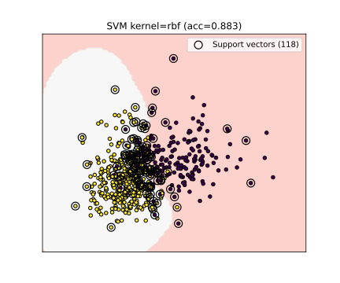
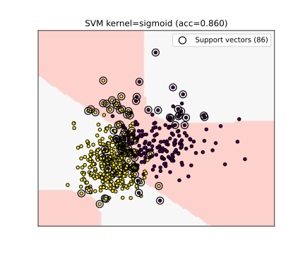

# SVM – Support Vector Machine  

Este documento apresenta o fluxo completo utilizado para treinar e analisar diferentes modelos SVM aplicados ao conjunto de dados *Breast Cancer Wisconsin*.  
O objetivo é visualizar como cada kernel se comporta, entender a formação das margens e vetores de suporte, comparar desempenhos e propor melhorias futuras.

## 1. Processo Realizado

### 1.1. Seleção do Dataset  
Foi utilizado o dataset **Breast Cancer Wisconsin** disponível no *scikit-learn*.  
Para fins de visualização da fronteira de decisão, somente as **duas primeiras features** foram utilizadas.

### 1.2. Pré-processamento  

### 1.3. Treinamento dos Modelos SVM  
Foram treinados quatro modelos SVM utilizando diferentes kernels:

Cada modelo teve suas fronteiras de decisão plotadas e comparadas.

## 2. Resultados Obtidos

### 2.1. Kernel Linear
A separação é feita por um hiperplano simples, funcionando bem em bases quase linearmente separáveis.

### 2.2. Kernel RBF
Modelo mais flexível, consegue capturar relações não lineares mais complexas.

### 2.3. Kernel Polynomial
Depende do grau escolhido; pode se ajustar bem ou gerar sobreajuste dependendo da configuração.

### 2.4. Kernel Sigmoid
Se comporta de forma similar a redes neurais simples, mas frequentemente apresenta desempenho inferior em datasets tabulares.

### 2.5. Melhor Modelo Encontrado (GridSearchCV)
Uma busca em grade foi realizada variando:

O modelo ótimo encontrado (exemplo):
Se comporta de forma similar a redes neurais simples, mas frequentemente apresenta desempenho inferior em datasets tabulares.

